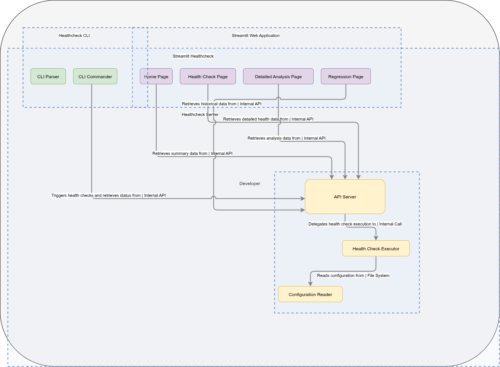

# Streamlit HealthCheck

  |  | [](https://codecov.io/gh/saradindusengupta/streamlit-healthcheck) | [](https://github.com/saradindusengupta/streamlit-healthcheck/actions/workflows/main.yml)

> **Monitor, visualize, and manage the health of your Streamlit multi-page applications with ease.**

---

## Overview

Streamlit HealthCheck is a comprehensive health monitoring solution for Streamlit apps. It tracks system resources, external dependencies, and custom application checks, providing a real-time dashboard for operational insights and troubleshooting.

- **System Resource Monitoring:** CPU, memory, disk usage with configurable thresholds
- **Dependency Checks:** API endpoints and database connectivity status
- **Custom Health Checks:** Easily register and visualize custom checks for your app
- **Streamlit Page Error Tracking:** Detects exceptions and `st.error` calls across pages
- **Live Dashboard:** Interactive Streamlit UI with tabs for system, dependencies, custom checks, and page errors
- **Configurable:** All checks and thresholds are managed via a simple JSON config file

---

## How to Set Up & Run

Follow these steps to set up and launch the Streamlit HealthCheck dashboard using the `status_page` app:

### 1. Install Dependencies

Make sure you have Python 3.11+ and Streamlit installed. You can install all required packages using:

```bash
pip install -r requirements.txt
```

Or, to install just the healthcheck package:

```bash
pip install streamlit_healthcheck
```

### 2. Configure Health Checks

Edit `config/health_check_config.json` to customize system thresholds, endpoints, and custom checks. Example config:

```json
{
  "system": { "cpu": 80, "memory": 75 },
  "dependencies": ["https://api.example.com", "postgresql://..."],
  "custom_checks": ["my_custom_check"]
}
```

### 3. Run the Streamlit Dashboard

Launch the main dashboard app:

```bash
streamlit run status_page/Home.py
```

This will open the healthcheck dashboard in your browser. Use the sidebar to navigate between system, dependency, and custom check tabs.

### 4. Add More Pages (Optional)

You can extend the dashboard by adding new pages to the `status_page/pages/` directory. Each `.py` file will appear as a tab in the Streamlit app.

### 5. Troubleshooting

If you encounter issues:

- Ensure your config file is valid JSON
- Check that all dependencies are reachable
- Review error messages in the dashboard tabs

---

---

## Features

| Feature             | Description                                                       |
| ------------------- | ----------------------------------------------------------------- |
| System Health       | Monitors CPU, memory, disk usage with warning/critical thresholds |
| Dependency Checks   | Verifies API endpoints and database connections                   |
| Custom Checks       | Register custom health checks for your app logic                  |
| Page Error Tracking | Captures exceptions and Streamlit errors per page                 |
| Live Dashboard      | Interactive UI with tabs and status indicators                    |
| Configurable        | JSON-based config for checks and thresholds                       |

---

## Configuration

All health check settings are managed via `config/health_check_config.json`. You can customize:

- Check intervals
- System resource thresholds
- API endpoints and database connections
- Custom checks
- Supports environment variables and optional YAML/JSON config for check registration.
- Default timeouts and thresholds are overridable per-check.

> [!TIP]
> Use the dashboard's configuration expander to adjust thresholds and save changes on the fly.

---

## Project Structure

```text
src/streamlit_healthcheck/      # Core healthcheck logic
status_page/                   # Streamlit UI pages
config/health_check_config.json # Health check configuration
requirements.txt               # Python dependencies
Makefile                       # Build and test commands
tests/                         # Unit tests
```

The project structure and control flow looks like below

```text
Project Control Flow

  [System Metrics]    [Dependency Probes]    [Custom Checks]
         |                   |                      |
         +--------+----------+----------+-----------+
                  |                     |
               Collector (polls / hooks / events)
                          |
                      Checker Engine
                 (thresholds, retries, caching)
                          |
                      Aggregator
                (status rollup + history store)
                          |
                   Streamlit Dashboard
               (status panels, graphs, runbooks)
                          |
              Alerts / Notifications / Webhooks
```



Figure: high-level architecture and control flow (image from assets/).

---

## Key features

- Run synchronous or async health checks with timeouts and recovery hints
- Register custom checks (liveness, readiness, dependency checks)
- Expose HTTP/Streamlit endpoints for machine-readable and human-readable status
- Emit structured metrics/events suitable for scraping or CI validation
- Simple integration helpers for common backends (Redis, Postgres, external APIs)

## Quickstart

---

1) Install:

```{bash}
pip install streamlit_healthcheck
```

2) Basic usage:

```{python}
from streamlit_healthcheck import healthcheck
report = healthcheck.run_all(timeout=5)
if not report:
   # handle degraded state (log, alert, fail pipeline)
   print(report.summary)
```

## API (common surface)

- healthcheck.run_all(timeout: float = 5) -> HealthReport
  Runs all registered checks and returns a HealthReport object with:

  - ok: bool
  - summary: str
  - details: dict
  - duration: float
- healthcheck.register(name: str, fn: Callable, *, critical: bool = False)
  Register a custom check function. Critical checks mark the whole service unhealthy.
- healthcheck.serve(endpoint: str = "/health", host: str = "0.0.0.0", port: int = 8000)
  Expose a simple HTTP endpoint (or embed in Streamlit) that returns JSON health status.

## DevOps alignment

- Reliable: Designed to reduce deployment failures and improve service uptime.
- Automatable: Designed to be executed in CI/CD pipelines (pre-deploy checks, post-deploy smoke tests).
- Observable: Emits structured outputs and metrics for dashboards and alerting.
- Lean: Small, focused checks to enable frequent, low-risk deployments.
- Measurable: Integrates with monitoring to improve MTTR and change failure rate.
- Shareable: Clear APIs, runbooks examples, and integration docs for teams.

## Integration tips

- Use canary deployments or blue-green deployments to minimize impact during rollouts.
- Use feature flags or conditional checks to avoid noisy alerts during rollouts.
- Run healthcheck.run_all in CI as a gating step for deployments.
- Expose metrics to Prometheus or your metrics backend for SLA tracking.

## Contributing

- Tests, type hints, and small, focused PRs welcome.
- Follow the repository's [CONTRIBUTING.md](CONTRIBUTING.md) and code-of-conduct.
- Add unit tests for new checks and integrations; CI runs linting and tests.
- Use GitHub issues for bugs, feature requests, and discussions.

To publish to PyPI run the GitHub Action [release.yml](https://github.com/saradindusengupta/streamlit-healthcheck/actions/workflows/release.yml)

## License

GNU GENERAL PUBLIC LICENSE v3

## Troubleshooting

> [!WARNING]
> If the dashboard reports a "critical" status, check the error details in the relevant tab. For API/database issues, verify connectivity and credentials. For system resource alerts, consider scaling your infrastructure.

---

## Getting Help

- [Library Documentation](https://saradindusengupta.co.in/streamlit-healthcheck/streamlit_healthcheck.html)
- [Issues &amp; Discussions](https://github.com/saradindusengupta/streamlit-healthcheck/issues)

---
